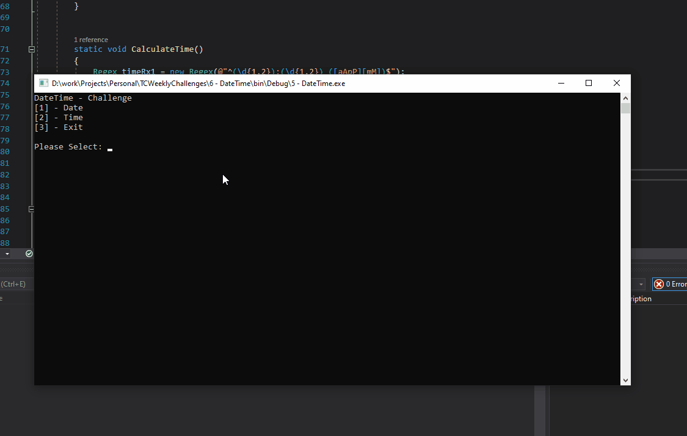

# DateTime Challenge

## Task
- Capture a date from the console and calculate how many days ago it was. Then capture a time from the console and calculate how many hours and minutes ago it was (assume less than now and not previous day). 
- **Bonus** For times, allow the user to choose to specify 12- or 24-hour format. For dates, allow the user to specify month/day/year or day/month/year format based upon their choice. Also, don’t assume times are not the previous day.

## Output

- Date 

- Time

## Notes

- Good challenge to review my Regex knowledge

## Source

- [Challenge Video](https://www.youtube.com/watch?v=vMHh35slMeE&list=PLLWMQd6PeGY1VcJGocm1wwtFCZUrh2sc9&index=6" target="_blank")
- [Regex Explain](http://rick.measham.id.au/paste/explain.pl?regex=%5E%28%5Cd%7B1%2C2%7D%29-%28%5Cd%7B1%2C2%7D%29-%28%5Cd%7B1%2C4%7D%29%24)
