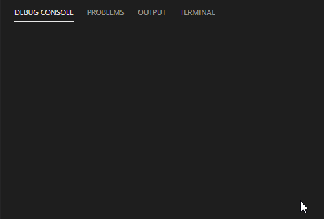

# Async/Await Chain Demo

A sample code for chaining promises using await/async.

## What this code does:

- Read all the files inside a folder (you will provide the folder path)
- Read all exported functions inside each files
- Execute each funtions

## Install and Run

- Fork and clone this repo
- Run `node .` (make sure you have nodejs installed)

## Output

