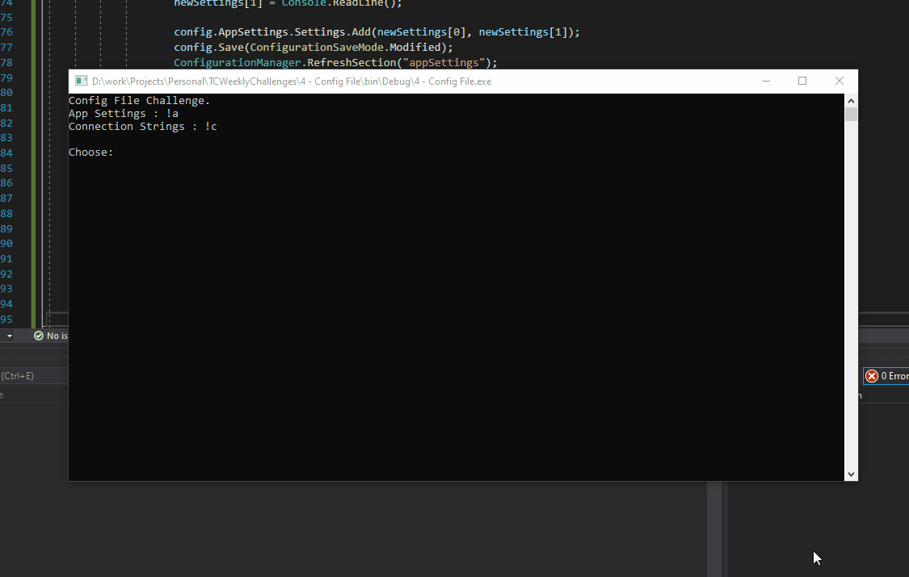

# Config File Challenge

## Task

- Read AppSettings or Connection Strings
- **BONUS** - Read All AppSettings or Connection Strings
- **BONUS** - Add New AppSetting or Connection String
- **BONUS** - Only Add if Settings doesn't exist yet.

## Output

AppSettings Demo

Connection Demo

## Notes

- Clearly, I went **OVERBOARD** but I'm proud of what I did 😂
- I found out that EF caches connection string, so there isn't no method to force a refresh. (For Now)

## Sources

- [Challenge Video](https://www.youtube.com/watch?v=8BFIT29asSY&list=PLLWMQd6PeGY1VcJGocm1wwtFCZUrh2sc9&index=5)
